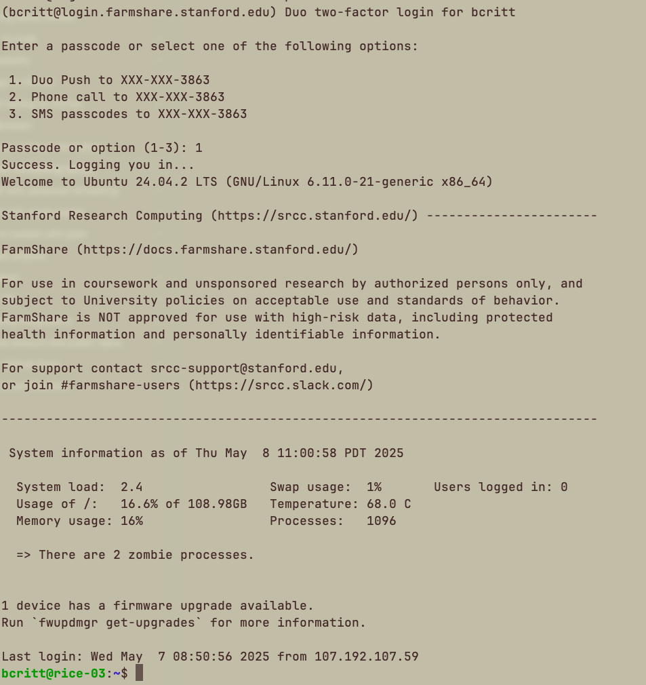
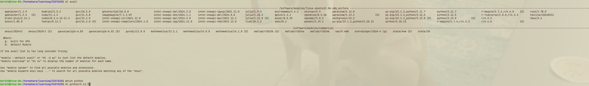
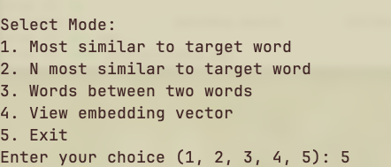

{
 "cells": [
  {
   "cell_type": "markdown",
   "id": "67d33485",
   "metadata": {},
   "source": [
    "# Huggingface/Word Embedding on HPC\n",
    "## Brad Rittenhouse, PhD\n",
    "## Stanford Research Computing\n",
    "### CESTA\n",
    "### May 9, 2025\n",
    "\n",
    ""
   ]
  },
  {
   "cell_type": "markdown",
   "id": "1a7c9c01",
   "metadata": {},
   "source": [
    "## HPC vs your normal research workflow\n",
    "\n",
    "### Similarities\n",
    "* You can still use R, python, and all (probably) of the packages you normally use.\n",
    "* With some adaptation, you can still achieve the same results/end products (with much greater horsepower)\n",
    "* There are ways to use jupyter, RStudio, etc. for interactive computing experience/IDEs\n",
    "\n",
    "### Differences\n",
    "* Compute is remote, need to connect to different machine.\n",
    "* Primarily designed as a CLI, not GUI, UX/UI.\n",
    "* Interactive workflows are not the norm: batch jobs are the standard, though interactivity is supported.\n",
    "* Shared systems mean you don't have complete freedom over software, installations, timelines. "
   ]
  },
  {
   "cell_type": "markdown",
   "id": "3d78ccd8",
   "metadata": {},
   "source": [
    "## Getting Started: Veni, Vidi, Vici\n",
    "\n",
    "### Veni\n",
    "\n",
    "[Stanford Research Computing] (https://srcc.stanford.edu/support/gettingstarted-hpc) has several free(!) systems available to researchers, including a whole partition for H&S researchers. Depending on your data/project, you may need to use one system over another; most people use the primary research cluster, _Sherlock_. Today, we're going to use the learning cluster, _Farmshare_ because you need to be sponsored by a PI to use Sherlock and anyone with a SUNet ID can use Farmshare.\n",
    "\n",
    "#### But how do you do that?\n",
    "\n",
    "All our systems are remote, so you'll need some way to connect to them. One way we won't talk about a ton today is Farmshare's [Open OnDemand] (https://ondemand.farmshare.stanford.edu/), which allows you to use IDEs like RStudio or JupyterLabs with our compute on the back-end. This has a good chance of being the best fit for your research workflow, but it doesn't really give us a good idea of what's happening \"under the hood,\" so we're not going to look at it much today.\n",
    "\n",
    "If you're not using OnDemand, the primary way of connecting to a remote computer is a tool/protocol called `ssh`, which stands for Secure Shell Protocol. Windows folks, open _Powershell_, Mac/Linux folks, open _Terminal_ and type: \n",
    "\n",
    "```ssh SUNetID@login.farmshare.stanford.edu```\n",
    "\n",
    "You'll need to answer \"yes\" to a question about fingerprinting, input your SU password (the cursor doesn't move so you may want to C&P it), and complete a 2FA. At this point, you should see an unassuming \"Welcome\" screen and your prompt should change to say you're on a machine called `rice-n`.\n",
    "\n",
    "\n",
    "\n",
    "### Vidi\n",
    "\n",
    "Okay, so you're on a \"rice\", but you probably don't know how to see anything else about this strange, new machine I've had you connect to. You may have seen in the welcome message that this is an Ubuntu (Linux) machine, and not just that, a CLI, or command line interface: uncharted territory for many of us. Not to worry, though: there are maybe a half dozen commands that can handle almost everything we'll want to do here!\n",
    "\n",
    "#### Moving and seeing in the shell\n",
    "\n",
    "Type\n",
    "```bash\n",
    "pwd\n",
    "```\n",
    "and you will see something like `/home/yourUsername/`. `pwd` stands for \"print working directory\" and it tells you \"where you are located\" in your computer. On a graphical system, this would be like the folder you have open in File Explorer. It's important to remember that when working in the terminal, you are very explicitly located in a specific place on your machine, and the directions you give to the machine will be interpreted from this position. `pwd` can be used to tell you this position at any given time. Our directory is empty right now, so let's create some directories (or folders):\n",
    "\n",
    "```bash\n",
    "mkdir out/ err/ /scratch/users/$USER/embeddings\n",
    "```\n",
    "\n",
    "which reads as \"make directory\" and then the directories you want to make. \n",
    "\n",
    "Now type:\n",
    "\n",
    "```bash\n",
    "ls\n",
    "```\n",
    "\n",
    "which stands for \"list\", and you should now see our `out` and `err`. If you type \n",
    "\n",
    "```bash\n",
    "cd /scratch/users/$USER/outputs\n",
    "```\n",
    "\n",
    "and hit the `Tab` button after the first few letters in each level, the shell will begin completing your commands. Because `cd` means \"change directory\", when you press `Enter`, you will move into the \"outputs\" directory. You can `pwd` to confirm you're in `/scratch/users/$USER/outputs` now, a place that didn't exist until you made it a second ago! We made this and the other directories because we're going to be directing the outputs of our script to them shortly. Note that the \"outputs\" directory looks a little different. We gave it a filepath and created it \"at a distance\" in \"scratch\", the fast storage section of any HPC system. You'll want to put your inputs and outputs in `$SCRATCH` in most instances. \n",
    "\n",
    "#### Review\n",
    "* `pwd`: print working directory (print your current location)\n",
    "* `ls`: list (list the contents of a directory)\n",
    "* `cd`: change directory\n",
    "* `mkdir`: make directory\n",
    "\n",
    "### Vici\n",
    "Now that we can see where we're at and what we're doing, we have a pretty good working command over our environment. \n",
    "\n",
    "**Question**: _If the files we need are at `/farmshare/learning/CESTA25`, how would we navigate to that space? Once we get there, how would we see them?_\n",
    "\n",
    "Once we're there, we can see several files. While having all of these file versions is not necessarily representative of a _normal_ research workflow, they represent the spectrum of ways you can do research in HPC, and even different points in an HPC workflow.\n",
    "\n",
    "\n",
    "By that I mean that you may start off debugging/prototyping interactively, with the ultimate goal of doing a big batch run for the actual research part. Currently, however, you're on what's called a \"login node\". This is a not-so-great computer where you can mostly connect to the system, move some files around, etc: nothing super intense. If you want to, say, install packages or run a program, you should move to a compute node. If you want to do those things interactively on Farmshare, you'd use the following command:\n",
    "\n",
    "```bash\n",
    "srun --partition=interactive --qos=interactive --pty bash\n",
    "```\n",
    "\n",
    "You'll notice your prompt changes from \"rice\" (login node) to \"iron\" (compute node) once the allocation is granted."
   ]
  },
  {
   "cell_type": "markdown",
   "id": "aecd5441",
   "metadata": {},
   "source": [
    "## Working with Power\n",
    "\n",
    "Okay, now that we have some compute, how do we use it? You may have noticed that most of the scripts in `CESTA25` are python scripts, so we probably need some type of python. Typing `which python` reveals that there is no system python currently. So how do we get it?\n",
    "\n",
    "### Modules & Packages\n",
    "\n",
    "Farmshare (and most of our other clusters) uses `lmod`, a Lua-based module system that allows us to package and maintain common software packages for our users. There are a few primary commands to be aware of for lmod, almost all of which start with `ml`:\n",
    "\n",
    "* `ml avail`: list all modules available on the system\n",
    "* `ml <module>`: load specified module\n",
    "* `ml list`: list all loaded modules\n",
    "* `ml purge <module>`: unload specified (or all) modules\n",
    "* `ml spider <keyword`: search for a module\n",
    "\n",
    "**Question**: _Given this, how would we load Python 3.12 for ourselves on Farmshare? How would we confirm we've done this successfully?_\n",
    "\n",
    "\n",
    "\n",
    "Beyond Python, we'll need a few other things to run our script. While we've looked at commands to see what files exist in certain spaces, we haven't looked at any that let us see in the files. A few of these include:\n",
    "\n",
    "* `cat`: Technically concatenate, when used with two files, it will combine them. With one, it will print the contents.\n",
    "* `head`: Will print the beginning of a file.\n",
    "* `tail`: Will print the end of a file.\n",
    "\n",
    "Use these to try and figure out some of the libraries we'll need.\n",
    "\n",
    "```pip3 install torch torchvision transformers sentence-transformers nltk```"
   ]
  },
  {
   "cell_type": "markdown",
   "id": "c6f6ad22",
   "metadata": {},
   "source": [
    "## Doing Research\n",
    "\n",
    "While there are a few different ways to organize this workflow, this one works the best for an hourish long session. _It can, though, be a good example of how you can adapt more hands-on forms of humanistic inquiry to HPC batch workflows._ First, we're going to run a batch script to produce our word embedding model. Then, we're going to start an interactive session to load and query it live. This way, we can do our heavy compute as batch while still being able to interrogate our dataset interactively.\n",
    "\n",
    "Most of our clusters, like most HPC clusters in general, use a _job scheduler_ called [Slurm](https://slurm.schedmd.com) whose job it is to take all the compute requests from all the users across the cluster and schedule them with consideration to available resources.\n",
    "\n",
    "So how do we make a request? This is done in an **sbatch script**, which is basically a shell script with a special set of instructions to Slurm at the top.\n",
    "\n",
    "### Sbatch Script\n",
    "\n",
    "```bash\n",
    "#!/bin/bash\n",
    "#SBATCH --job-name=word_embeddings                           #Arbitrary job name\n",
    "#SBATCH --output=/home/users/%u/out/word_embeddings_%j.out   #System output file, with filepath\n",
    "#SBATCH --error=/home/users/%u/err/word_embeddings_%j.err    #System error file\n",
    "#SBATCH --time=25:00                                         #Time limit\n",
    "#SBATCH --partition=normal                                   #Partition to process (sinfo P to see what you have access to)\n",
    "#SBATCH --mem=8G                                             #Memory requested\n",
    "#SBATCH --cpus-per-task=4                                    #CPUs requested\n",
    "\n",
    "module load python/3.12  #Load Python\n",
    "\n",
    "python3 /farmshare/learning/CESTA25/batchHug.py #Run script\n",
    "```\n",
    "\n",
    "This will submit ```batchHug.py``` to a job queue where it will be processed in an order determined by Slurm (primarily by resources requested for this job and resources you've requested recently). You can monitor your job in queue with\n",
    "\n",
    "```bash\n",
    "watch squeue --me\n",
    "```\n",
    "\n",
    "(Ctrl + C to leave screen)\n",
    "\n",
    "It will take a few minutes to complete, but once it does, you'll have a pickle file @ ```/scratch/users/$USER/embeddings```. \n",
    "\n",
    "**Question**: _How can you confirm we successfully produced the output?_\n",
    "\n",
    "\n",
    "\n",
    "### Interactive Querying\n",
    "\n",
    "Now that we have a word embedding, we can query it at our leisure. The other py file is set up to do this interactively. You run a python script the same way you do on your local machine, though you may not do this very often:\n",
    "\n",
    "```python3 interactiveHug.py```\n",
    "\n",
    "Here you can just follow the instructions to explore the data. While the compute isn't super necessary for this step (you've already made the embedding), as long as you're on an iron node, you still have the resources, and really any compute should be done _off_ the login nodes, just to be safe.\n",
    "\n",
    "\n"
   ]
  },
  {
   "cell_type": "markdown",
   "id": "ff329d7b",
   "metadata": {},
   "source": [
    "### Review: What did we learn?\n",
    "\n",
    "* How to log on to a remote machine\n",
    "* HPC Architectures\n",
    "* Basic Unix commands for HPC navigation\n",
    "* Slurm basics: sbatch, squeue, srun\n",
    "* OnDemand\n",
    "* Basics for Python, R on HPC\n",
    "* Module usage on HPC"
   ]
  }
 ],
 "metadata": {
  "kernelspec": {
   "display_name": "Python 3 (ipykernel)",
   "language": "python",
   "name": "python3"
  },
  "language_info": {
   "codemirror_mode": {
    "name": "ipython",
    "version": 3
   },
   "file_extension": ".py",
   "mimetype": "text/x-python",
   "name": "python",
   "nbconvert_exporter": "python",
   "pygments_lexer": "ipython3",
   "version": "3.11.1"
  }
 },
 "nbformat": 4,
 "nbformat_minor": 5
}
